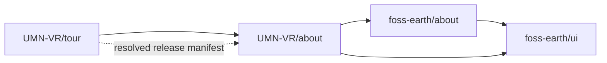

# UMN VR repository graph

Status: proposal, 2026-10-08. [Open the graph](repository-split-graph.html).
Its authoritative metadata is [repository-split-graph.json](repository-split-graph.json).
The graph describes proposed boundaries, not completed extraction or deployment.

The [campus-tour tab inventory](tab-inventory.md) records all 13 current tab
IDs, their globe/panorama availability, source evidence and proposed owners.
It distinguishes current tabs from future Dev/Weather contributions, website
routes, panel sections and host-owned content/metadata.

`UMN-VR/UMN-VR.github.io` owns the club website. A proposed `UMN-VR/tour` owns
the campus experience, accessibility, photographs, placements, platform import,
branding and its developer contributions. `UMN-VR/twin-cities-content` is an
optional media release boundary; independent versioned hosting can provide it
without another repository. See the existing
[content delivery design](../content-delivery.md).

The campus tour consumes FOSS Earth's engine, UI, renderer, toolbar, sky/weather,
Scenes, 360 viewer and developer framework, and `UMN-VR/about` for its About tab.
Renderer owns device/scene/frame
services; globe engine consumes it without a reverse import. The tour registers
its own toolbar callbacks and values using shared UI primitives. Generic check/setup tools remain
FOSS Earth-owned. This application has no dependency on flight code, content,
documentation or tooling. UMN documentation, research, community guidance and
the tour's release/workspace manifests remain UMN-owned. The tour supplies its
own manifest and app-specific Dev contributions; no branded graph data moves
into the shared viewer.

## Scenes and image representations

`foss-earth/scenes` owns the scene format/envelope, placement contracts,
navigation orchestration and Scenes tab. It consumes `foss-earth/360`,
`foss-earth/images` and UI. The campus tour owns its actual scene and placements,
photographs, captions, credits, links and platform-specific import.

`foss-earth/360` owns the active `360: <photograph title>` tab, 360 image settings
and viewer lifecycle. It composes four representation repositories:
`foss-earth/equirectangular`, `foss-earth/cubemap`, `foss-earth/tiled-cubemap`
and `foss-earth/preview-sheets`. Gnomonic and equi-angular tiled cubemaps remain
variants in `tiled-cubemap`, sharing one storage structure. Common image
contracts, budgets and cache belong to `foss-earth/images`.

Campus preparation consumes `foss-earth/360` tooling composed from those
representations; scene manifest checks come from `foss-earth/scenes`.
The [image repository proposal](../../../../foss-earth/docs/proposals/image-repositories.md)
defines these interfaces and the current source-to-repository mapping. These
are proposed package boundaries; current public FOSS Earth exports remain the
integration path until extraction.

## About code and data

**`UMN-VR/about` is a proposed repository**, applying the same feature-tab
boundary as `0sfs/about`. It owns the campus About tab's composition, project
information, links/credits, authored dependency-graph metadata and the adapter
that presents the installed tour release. `foss-earth/about` owns the shared
panel/viewer, graph layout, schema, provenance presentation and validation.



The tour owns release assembly and exact dependency pins. It supplies the
resolved manifest as data; `UMN-VR/about` does not import the tour runtime to
discover its dependencies. Authored graph descriptions move to `UMN-VR/about`
when it is extracted; they remain a proposal until a release manifest confirms
what is installed. Keeping the viewer shared does not require keeping the
campus About contribution in the tour repository.

Today there is no separate campus About implementation: FOSS Earth's
[`aboutPanel.ts`](../../../../foss-earth/src/shell/aboutPanel.ts) builds the
shared panel, [`createGlobeApp.ts`](../../../../foss-earth/src/app/createGlobeApp.ts#L738)
constructs it, and [`mountGlobeApp.tsx`](../../../../foss-earth/src/app/mountGlobeApp.tsx#L42)
mounts it. UMN's [`vite.config.ts`](../../vite.config.ts#L80) supplies its build
identity and the `builtFrom()` metadata plugin. Extraction adds a host-supplied
About contribution to that mounting path; shared globe code must never import
`UMN-VR/about` itself. The prototype files below stay in this checkout until
the proposed repository is created.

## Editing the graph prototype

The JSON is the application-owned source of truth. The self-contained HTML is
generated using the shared FOSS Earth template and generator. Code,
content/metadata and publication/research/tooling arrows all run from consumer
to dependency, but only code arrows describe package imports. Scope rules
reject ownership inversion and the generator rejects literal code cycles.

From this checkout:

```sh
node ../../foss-earth/scripts/build-repository-graph.mjs --input=docs/proposals/repository-split-graph.json --out=docs/proposals/repository-split-graph.html
```

Edit the JSON or shared FOSS Earth template rather than the generated HTML.
The generated artifact records provenance and its reproduction command, works
offline and provides a text index as well as the interactive diagram. Generating
or opening it does not create repositories or deploy the tour.
