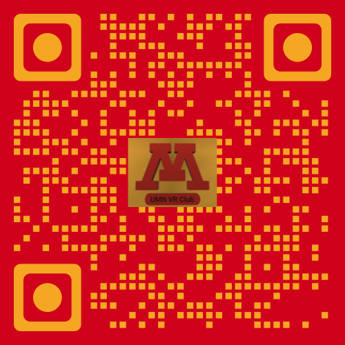

# UMN VR

## GoldyDog:
[https://umn-vr.github.io/GoldyDog/](https://umn-vr.github.io/GoldyDog/)

## Youtube:

  
 

<iframe width="100%" height="615" src="https://www.youtube.com/embed/_vy5MKZzaGs" title="YouTube video player" frameborder="0" allow="accelerometer; autoplay; clipboard-write; encrypted-media; gyroscope; picture-in-picture" allowfullscreen></iframe>

<iframe width="100%" height="615" src="https://www.youtube.com/embed/yX52vTmb2IM" title="YouTube video player" frameborder="0" allow="accelerometer; autoplay; clipboard-write; encrypted-media; gyroscope; picture-in-picture" allowfullscreen></iframe>

## Photogrammetry:

### WebGL
 
You may go to [https://umn-vr.github.io/WebGL_Demo](https://umn-vr.github.io/WebGL_Demo/) on a headset's browser or a PC connected to a Headset and try the experience

### Polycam:

<iframe width="100%" height="815" frameborder="0" src="https://poly.cam/capture/4BF7B293-8FC5-4967-89F2-769D15F30F26"></iframe>

[https://poly.cam/@Felipegalind0](https://poly.cam/@Felipegalind0)

### Github:
[https://github.com/UMN-VR](https://github.com/UMN-VR)

### Google Drive: 

Click any of the QR Codes or pictures to access the link!
## Discord:

## Signup Form:

## Tip Sheet

## About

We are a student group that meets occasionally in the HSL virtual reality lab. We make VR apps, 360 videos, and much more. We were founded by Felipe Galindo with the help of staff member Charlie Heinz in 2021. 

## Founding Members: 

- Charlie Heinz
- Felipe Galindo 
- Jimena Jimenez
- Simon Ky
- Tremayne Talbot
- Alea Iliarski
- Nathan Hafrey
- Donald Bystrom
- John Roess

<iframe width="100%" height="815" frameborder="0" src="https://datastudio.google.com/embed/reporting/016e6d8d-05f6-4d64-9814-4486abb10e84/page/JgD" frameborder="0" style="border:0" allowfullscreen></iframe>
[https://datastudio.google.com/embed/reporting/016e6d8d-05f6-4d64-9814-4486abb10e84/page/JgD](https://datastudio.google.com/embed/reporting/016e6d8d-05f6-4d64-9814-4486abb10e84/page/JgD)

[https://umn-vr.github.io/GoldyDog/](https://umn-vr.github.io/GoldyDog/)
